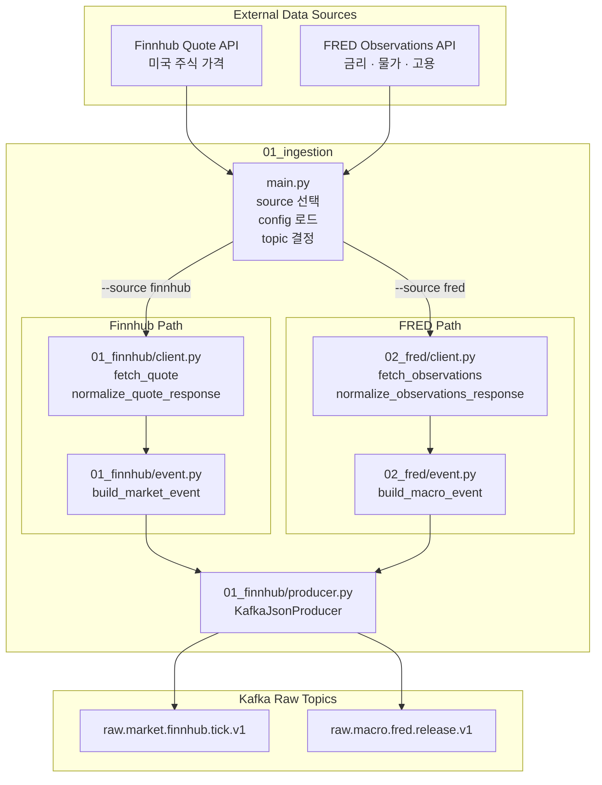
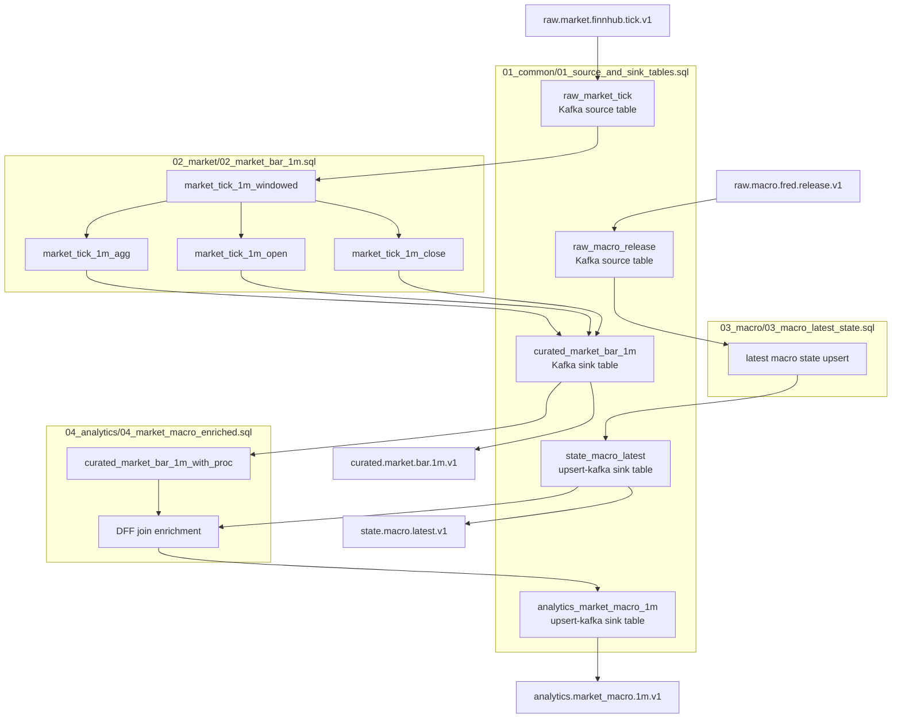
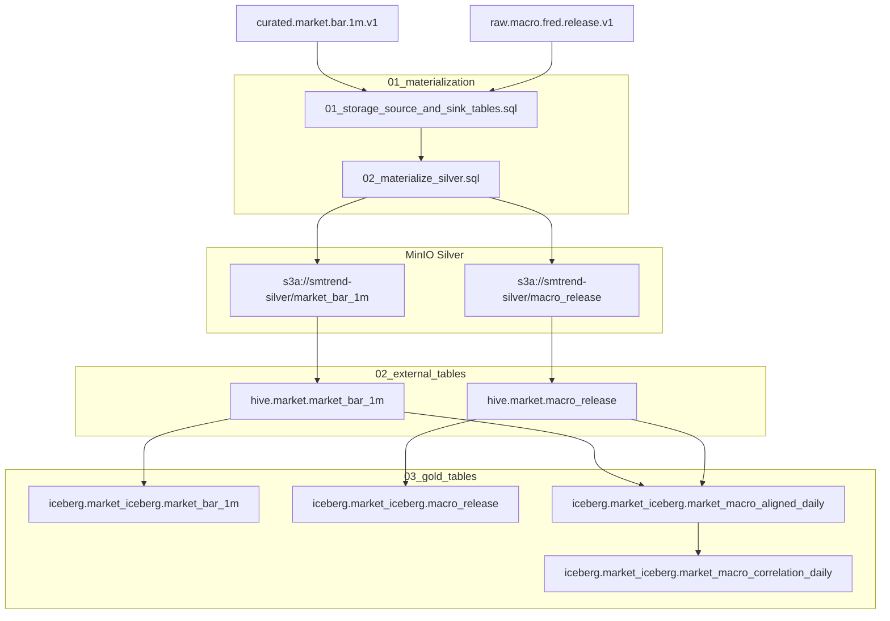
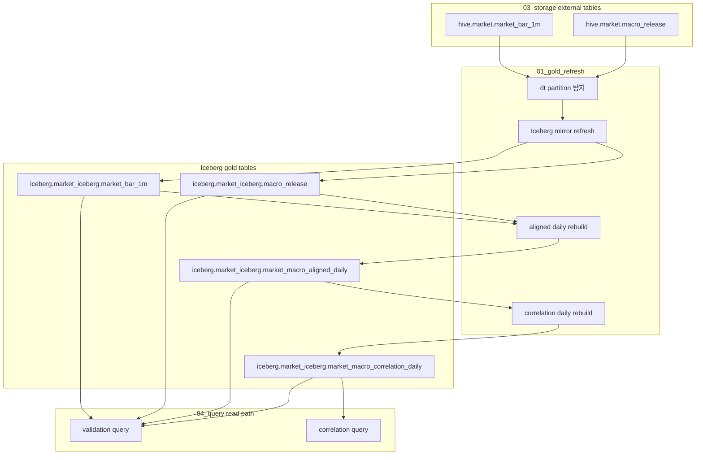
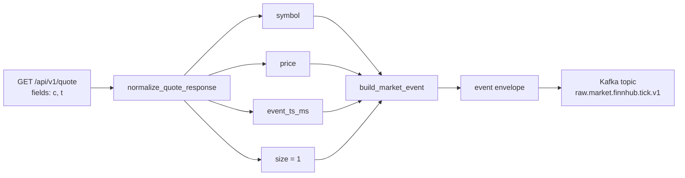
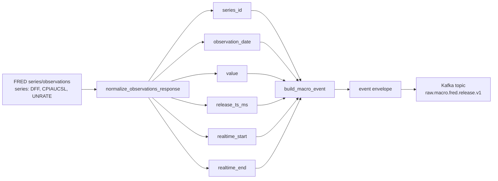
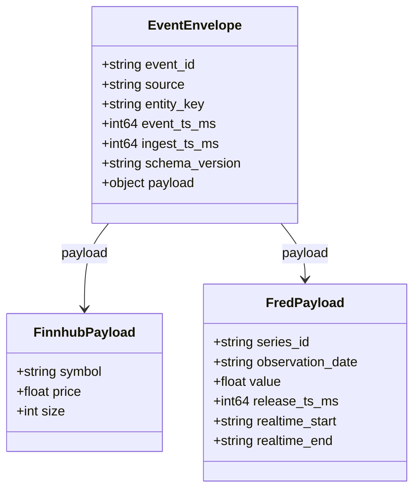
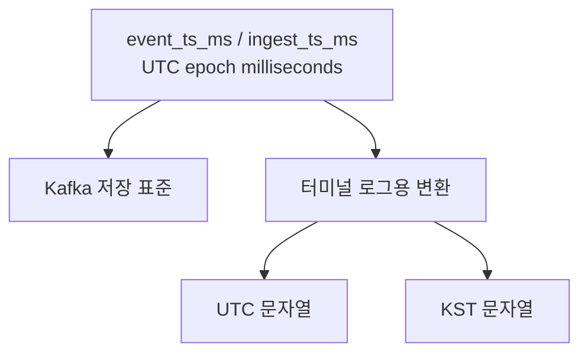
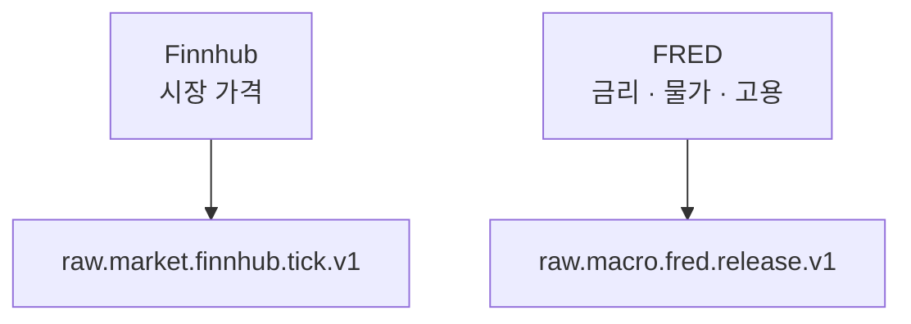

# Dataflow Visualization

이 문서는 현재 구현 기준의 전체 데이터 흐름을 Mermaid로 시각화한 문서다.
현재 포함 범위는 아래 네 레이어다.

- `01_ingestion`: 외부 데이터 소스 수집 및 Kafka raw topic 적재
- `02_processing`: raw topic 을 읽어 curated / state / analytics 데이터 생성
- `03_storage`: processing 결과를 durable storage 와 warehouse table 로 연결
- `04_query`: stored table 을 refresh / validation / analytics query 로 조회

---

## 1. 현재 전체 흐름

```mermaid
flowchart LR
    subgraph Infra[00_infra]
        KAFKA[Kafka]
        FLINK[Flink SQL]
    end

    subgraph Ingestion[01_ingestion]
        FH_ING[Finnhub quote 수집]
        FR_ING[FRED macro 수집]
    end

    subgraph RawTopics[Kafka Raw Topics]
        R1[raw.market.finnhub.tick.v1]
        R2[raw.macro.fred.release.v1]
    end

    subgraph FlinkSourceTables[Flink Source Tables]
        T1[raw_market_tick]
        T2[raw_macro_release]
    end

    subgraph Processing[02_processing]
        P1[02_market\nmarket_tick_1m_*\n1분 bar 집계]
        P2[03_macro\nlatest state 생성]
        P3[04_analytics\nmarket + macro 조인]
    end

    subgraph FlinkSinkTables[Flink Sink Tables]
        S1[curated_market_bar_1m]
        S2[state_macro_latest]
        S3[analytics_market_macro_1m]
    end

    subgraph OutputTopics[Kafka Processed Topics]
        O1[curated.market.bar.1m.v1]
        O2[state.macro.latest.v1]
        O3[analytics.market_macro.1m.v1]
    end

    subgraph Storage[03_storage]
        ST1[01_materialization\nsilver parquet 적재]
        ST2[02_external_tables\nHive external table 정의]
        ST3[03_gold_tables\nIceberg gold table 정의]
    end

    subgraph Silver[MinIO Silver Parquet]
        SV1[market_bar_1m]
        SV2[macro_release]
    end

    subgraph Gold[Iceberg Gold Tables]
        GD1[market_bar_1m]
        GD2[macro_release]
        GD3[market_macro_aligned_daily]
        GD4[market_macro_correlation_daily]
    end

    subgraph Query[04_query]
        Q1[01_gold_refresh\nincremental refresh]
        Q2[03_validation\nexternal/gold validation]
        Q3[02_analytics_queries\ncorrelation query]
    end

    FH_ING --> KAFKA
    FR_ING --> KAFKA
    KAFKA --> R1
    KAFKA --> R2

    R1 --> T1
    R2 --> T2
    FLINK --> T1
    FLINK --> T2

    T1 --> P1
    T2 --> P2
    P1 --> S1
    P2 --> S2
    S1 --> O1
    S2 --> O2
    S1 --> P3
    S2 --> P3
    P3 --> S3
    S3 --> O3

    O1 --> ST1
    R2 --> ST1
    ST1 --> SV1
    ST1 --> SV2
    SV1 --> ST2
    SV2 --> ST2
    ST2 --> ST3
    ST3 --> Q1
    Q1 --> GD1
    Q1 --> GD2
    Q1 --> GD3
    Q1 --> GD4
    GD1 --> Q2
    GD2 --> Q2
    GD3 --> Q2
    GD4 --> Q2
    GD4 --> Q3
```

이게 현재 기준의 **end-to-end 전체 구조**다.
즉, 외부 API에서 데이터를 수집하고 Kafka raw topic에 적재한 뒤,
Flink SQL 이 Kafka topic 자체를 바로 다루는 것이 아니라,
먼저 `raw_market_tick`, `raw_macro_release` 같은 source table 로 읽고,
그 결과를 다시 `curated_market_bar_1m`, `state_macro_latest`, `analytics_market_macro_1m`
같은 sink table 을 통해 output topic 으로 내보낸다.

그 다음 `03_storage` 는 이 output 과 raw macro release 를 읽어
`market_bar_1m`, `macro_release` silver parquet 를 만들고,
그 위에 Hive external / Iceberg gold table 정의를 올린다.

마지막으로 `04_query` 는 external/silver 를 읽어 Iceberg gold 를 incremental refresh 하고,
validation 과 correlation query 로 실제 조회 가능한 분석 결과를 만든다.

그 다음 future 단계는 하나의 묶음이 아니라 아래처럼 분리된다.

- `05_serving`: Druid 같은 serving datasource 로 realtime 결과를 노출
- `06_visualization`: Superset 같은 dashboard / chart 구성

즉 Superset 은 Trino/Iceberg query path 로도 붙을 수 있고,
필요하면 Druid serving path 로도 붙을 수 있다.

---

## 2. 01_ingestion 전체 수집 흐름

---

## 3. 02_processing 전체 처리 흐름

이 흐름은 `bash 00_infra/run_processing_sql.sh` 가 아래 순서로 SQL 을 합쳐 실행하는 구조와 맞춰져 있다.

1. `01_common/01_source_and_sink_tables.sql`
2. `02_market/02_market_bar_1m.sql`
3. `03_macro/03_macro_latest_state.sql`
4. `04_analytics/04_market_macro_enriched.sql`

즉 processing 레이어는 추상적인 박스 3개가 아니라,
**Kafka topic -> Flink source table -> SQL view/aggregation -> Flink sink table -> Kafka topic**
형태로 실제 구현되어 있다.

### processing sink table 이름 의미

위 다이어그램에 나온 세 sink table 이름은 각각 아래 의미를 가진다.

| Flink sink table | 연결 output topic | 의미 |
|---|---|---|
| `curated_market_bar_1m` | `curated.market.bar.1m.v1` | Finnhub raw tick 을 종목별 **1분 market bar(시가/고가/저가/종가/volume/tick_count)** 로 정리한 결과 |
| `state_macro_latest` | `state.macro.latest.v1` | 각 macro `series_id` 에 대해 **지금 기준 최신 값** 을 상태 형태로 유지하는 결과 |
| `analytics_market_macro_1m` | `analytics.market_macro.1m.v1` | `curated_market_bar_1m` 에 최신 macro 상태를 붙여서 만든 **market + macro 결합 분석 결과** |

즉 이름만 보면 기술적인 테이블처럼 보이지만,
실제로는 **가공된 시장 bar**, **최신 거시 상태**, **시장+거시 결합 분석 결과** 를 뜻한다.

### 왜 `curated_market_bar_1m` 가 중요한가

`curated_market_bar_1m` 는 raw tick 을 단순 저장해 둔 테이블이 아니라,
이후 모든 downstream 해석의 기준이 되는 **시장 1분 요약 단위** 다.

- `open_price`, `high_price`, `low_price`, `close_price`: 그 1분 가격 움직임 구조
- `volume`: 그 구간의 누적 거래량
- `tick_count`: 그 구간에 들어온 quote/event 개수

즉 "시장 가격이 어떻게 움직였는가" 를
tick 단위가 아니라 **분석 가능한 1분 bar 단위** 로 바꿔 둔 결과다.

### analytics 결합 로직과 경제적 의미

현재 `analytics_market_macro_1m` 는
`curated_market_bar_1m` 의 각 row 에 고정 `series_id = 'DFF'` 를 붙인 뒤,
`state_macro_latest` 와 `series_id` 기준으로 조인해서 만든다.

이때 결과에는 아래 값이 같이 들어간다.

- `macro_value`: 최신 `DFF` 값
- `release_ts_ms`: 그 macro 값의 기준 시각
- `macro_age_minutes`: 시장 bar 시작 시각과 macro 기준 시각의 차이(분)

이 구조의 경제적 의미는,
시장을 "가격만 있는 데이터" 로 보지 않고
**현재 정책금리 상태(DFF)라는 거시 배경 위에서 형성된 1분 움직임** 으로 해석한다는 데 있다.

예를 들어 이 결과를 보면
"금리 수준이 이런 상태일 때 특정 종목의 1분 bar 가 어떻게 형성됐는가"
를 같이 볼 수 있다.

다만 현재는 starter 구현이라
여러 macro series 를 동시에 붙이거나,
시점 정합성을 더 정교하게 맞춘 historical as-of join 까지 한 것은 아니다.
지금은 `DFF` 최신 상태 하나를 붙이는 최소 버전이다.

---

## 4. 03_storage 전체 저장 흐름

현재 `03_storage` 의 실제 저장 결과는 silver parquet 두 종류다.

- `market_bar_1m`: processing 된 1분 시장 bar
- `macro_release`: 원본 macro release 이력

그리고 그 위에서 읽을 warehouse table 골격으로 아래를 만든다.

- Hive external table: `hive.market.market_bar_1m`, `hive.market.macro_release`
- Iceberg gold table: `market_bar_1m`, `macro_release`, `market_macro_aligned_daily`, `market_macro_correlation_daily`

중요한 점은,
`03_storage` 는 gold table 을 **정의** 할 뿐이고,
그 안에 데이터를 실제로 채우는 refresh 는 `04_query` 가 담당한다.

---

## 5. 04_query 전체 조회 흐름

현재 `04_query` 의 실제 역할은 아래와 같다.

- silver external table 을 읽어 Iceberg mirror / derived gold 를 갱신
- external / gold row count validation 수행
- `market_macro_correlation_daily` 에 대한 최종 correlation query 실행

즉 `04_query` 는 저장 이후 단계에서
**gold 를 실제 데이터로 채우고, 그 결과를 조회/검증하는 레이어** 다.

그 이후 단계는 아래처럼 나뉜다.

- `05_serving`: realtime/query 결과를 serving datasource 로 유지
- `06_visualization`: serving/query 결과를 사람이 보는 대시보드로 구성

이때 `05_serving` 은 필수 단계가 아니라,
**realtime serving latency 가 중요할 때 추가되는 optional path** 로 이해하면 된다.

---

## 6. Finnhub 시장 데이터 흐름

### Finnhub 비즈니스 의미

- 목적: 미국 주식 가격 변화를 빠르게 수집
- 사용 필드 최소화: `c`(현재가), `t`(quote 시각)
- 결과: downstream에서 bar 집계나 macro 조인에 사용할 최소 시장 이벤트 생성

---

## 7. FRED 거시 데이터 흐름

### FRED 비즈니스 의미

- `DFF`: 금리 / 연준 정책 방향
- `CPIAUCSL`: 물가 / 인플레이션 흐름
- `UNRATE`: 고용 / 실업 흐름
- 결과: 시장 데이터만으로 설명되지 않는 거시 배경을 함께 적재

---

## 8. 공통 이벤트 Envelope 구조

---

## 9. 운영자가 보는 시간 vs 저장 표준

### 시간 처리 원칙

- 저장 표준: `UTC epoch milliseconds`
- 사람이 볼 때만: `UTC + KST` 같이 표시
- 즉 **데이터 저장 기준은 하나**, **운영자 확인용 표현만 두 가지**다.

---

## 10. 현재 범위 요약

현재 시점에서 `01_ingestion` 기준 구현된 범위는:

- 실데이터 소스: `Finnhub`, `FRED`
- 결과물: 두 소스를 Kafka raw topic으로 적재
- 제외 범위: mock/test 전용 소스
